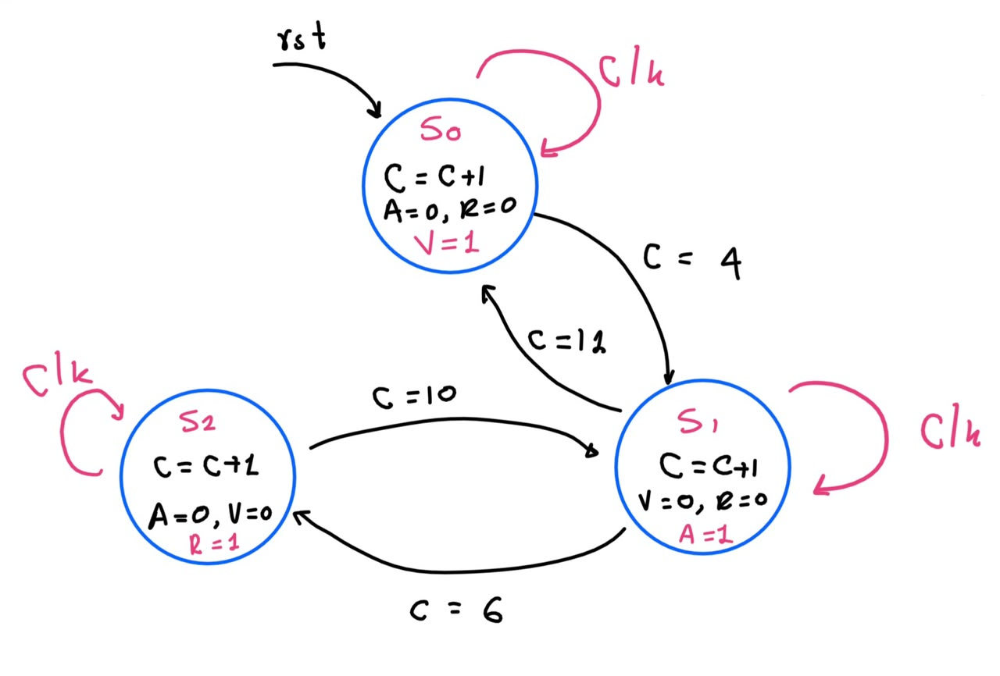
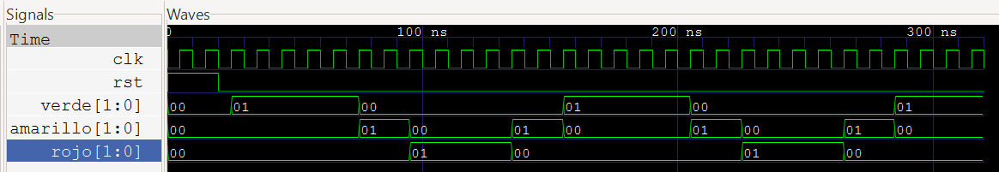
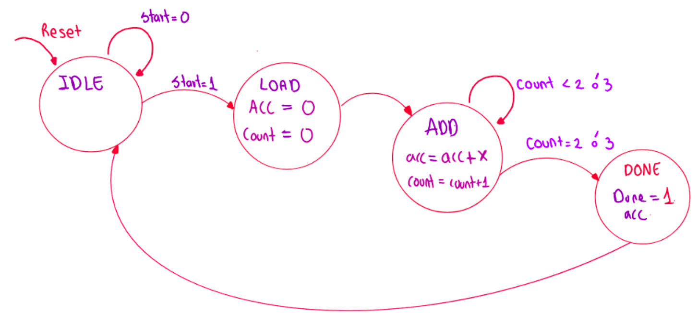
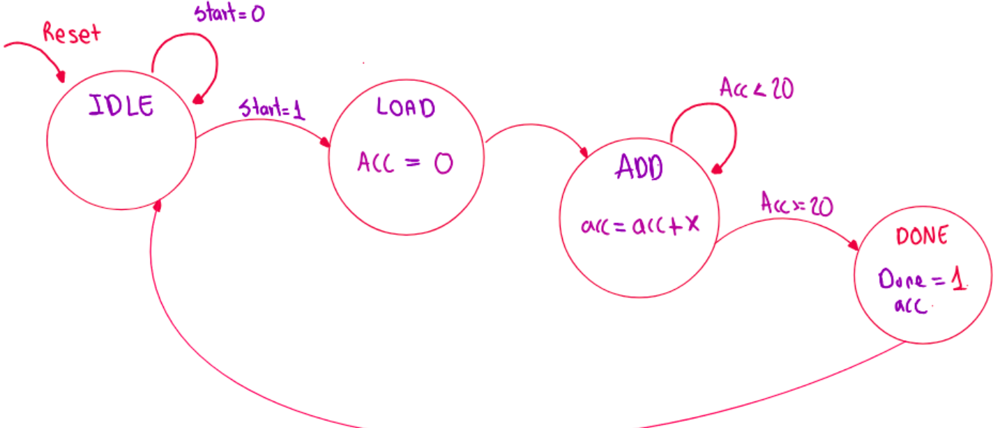
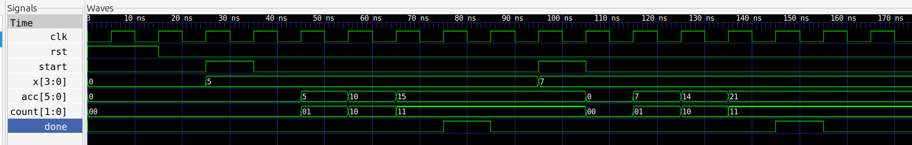
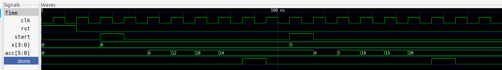

# Laboratorio 00  
## Introducción a Verilog, Simulación y Máquinas de Estados Finitos (FSM)

---
## FSM de control – Semáforo simple
**Descripción:** 
Se diseñó un semáforo vehicular controlado por una FSM de tres estados (`Verde: S0`, `Amarillo: S1`, `Rojo: S2`). 
* .



El semáforo se implementó como una máquina de estados finitos de tipo Moore con tres estados. Se apoya en un contador (C) que marca la duración de cada luz y que también permite decidir la siguiente transición. El sistema es síncrono con el flanco de subida del reloj (clk) y tiene un reset asíncrono activo en alto (rst). Al activarse el reset, la máquina va al estado S0, el contador toma el valor 0 y se reinicia.

Se implementaron tres estados, S0=verde, S1=amarillo, S2=rojo, los cuales funcionaban a 5, 2 y 4 ciclos respectivamente, reiniciando el contador a 0 tras pasar por todos los ciclos y así evitar que el contador se desborde. 

**Codigo elaborado:** 
En cuanto al codigo se definieron las entradas que en este caso serian el *rst* y el *clk*, se crearon ademas las salidas para cada color, y se definieron los parametros locales y registros necesarios para manejar los cambios entre  estados todo con el fin del correcto funcionamiento del diseño.

```verilog
    module semaforo(
        input  wire clk,
        input  wire rst,
        output reg [1:0] verde,
        output reg [1:0] amarillo,
        output reg [1:0] rojo

        
    );

    localparam S0 = 2'b00;
    localparam S1 = 2'b01;
    localparam S2 = 2'b10;
    reg [3:0] contador;
    reg [1:0] estado;
```

Toda la lógica está en un único bloque always que se ejecuta en el flanco de subida del reloj o del reset. Como rst aparece en la lista de sensibilidad, el reset es asíncrono: actúa en cuanto se activa, sin esperar al reloj. Al activarse, la máquina pasa a S0, el contador vuelve a 0 y todas las luces se apagan.

```verilog
always @(posedge clk or posedge rst) begin
    if(rst)begin
        estado <= S0;
        contador <= 0;
        verde <= 2'b00;
        amarillo <= 2'b00;
        rojo <= 2'b00;
    end
```

A continuación se describen los tres estados, utilizando el operador no bloqueante <= para que todos los registros fueran actualizados al mismo timpo que el flanco, modelando asi correctamente el comportamiento de los flip-flops.

```verilog
            if (estado == S1)begin
                verde = 2'b00;
                amarillo <= 2'b01;
                rojo <= 2'b00;
                if (contador == 6) begin
                    estado <= S2;
                    contador <= contador + 1;
                end
                else begin
                        contador <= contador + 1;
                    end
                if (contador ==  12) begin
                    estado <= S0;
                    contador <= 0;
                end
            end

```

Según la máquina de estados, cuando el contador alcanza el valor 10 en el estado S2, la máquina regresa al estado S1 para la segunda fase de amarillo, con el contador en 11. Cuando el contador llega a 12, la máquina pasa a S0 y el contador se reinicia a 0 mediante la asignación contador <= 0. Este reinicio es importante porque hace que el verde vuelva a durar 5 ciclos y que el proceso del semáforo se repita siempre con los mismos tiempos. Sin él, el contador se desbordaría de 15 a 0 y el verde duraría 8 ciclos.

#### Simulaciones 




El testbench genera un reloj de 10 ns de periodo y mantiene el reset activo durante los primeros ns. En ese intervalo las tres luces permanecen en 00, porque el bloque de reset las inicializa y así se evita que aparezcan valores indefinidos.

La secuencia de luces es verde, amarillo, rojo, amarillo y de nuevo verde, que coincide con la máquina de estados diseñada. En ningún instante hay dos luces encendidas a la vez: cada vez que una luz se apaga, la siguiente se enciende en el mismo flanco de reloj.

---
## Acumulador Secuencial

### Diseño implementado


El Acumulador Secuencial es una máquina de estados finita (FSM) con datapath. De este modo, el datapath es la estructura de hardware encargada de mover, almacenar y procesar la información, mientras que la FSM gestiona las señales que activan o desactivan los componentes en el datapath.

#### FSM para sumar 3 o 4 veces

Hay 4 entradas: las señales de `clock` y `reset`, una señal de `start` y una señal `x` con espacio hasta de 4 bits.

Hay dos salidas: `acc` que corresponde a un registro de 6 bits de longitud para guardar el acumulado de la señal de entrada y `done` para terminar el proceso. 

La FSM se compone de 4 estados:
* **IDLE:** Espera a la señal de `start`; mientras `start` es 0 se mantiene en el mismo estado, cuando `start` es 1, pasa a `LOAD`.
* **LOAD:** `acc` se inicializa en 0 al igual que una variable de `count`. Sin esperar a otra señal, se pasa al estado de `ADD`.
* **ADD:** Se suma `x` al `acc` y uno al contador. Se permanece en el mismo estado, continuando con el proceso de incrementación de `acc` y del contador mientras que el contador no pase de 3 o 4 (2 o 3 empezando a contar desde 0). Cuando se deja de cumplir la condición establecida para permanecer en el estado `ADD`, se pasa a `DONE`.
* **DONE:** Se tiene como salida `DONE = 1` y se vuelve al estado de `IDLE`.



#### FSM para sumar hasta que acc >= 20

Para esta variante se sigue exactamente la misma lógica con la única diferencia que ya no se tiene en cuenta el contador, sino únicamente el valor de `acc`, el cual al ser mayor o igual a 20 pasa a `DONE`.


---

#### Simulaciones

Se diseñó un testbench para probar el correcto funcionamiento del acumulador secuencial.

**Para sumar x 3 veces:**

Se definieron las entradas al DUT
```verilog
reg clk;
reg rst;
reg start;
reg [3:0] x;
```

y las salidas 

```verilog
wire [5:0] acc;
wire done;
```

Se hizo la instanciación del módulo vinculando todas las señales como:

```verilog
acumulador uut (
    .clk(clk),
    .rst(rst),...
```

Luego se generó la señal del reloj, con ciclos de duración de 10ns y dentro del bloque de initial begin se generaron los archivos .vcd para correr en GTKWave.
Las señales se inicializaron en 0, manteniendo rst por 15ns. Se hicieron dos pruebas, primero se estableció x = 5, por lo tanto el resultado debe ser 15 y luego x = 7 lo cual debe dar como resultado 21.

**Para sumar hasta que acc >= 20**

Se siguió la misma estructura que para el testbench anterior, cambiando solamente las características de la prueba. En este caso se tiene una señal de entrada x con valor de 6, que necesitará 4 ciclos del reloj para llegar a un valor mayor a 20; la segunda prueba tiene a x = 5, de tal forma que se demorará de nuevo 4 ciclos en llegar a 20.
```verilog
// Prueba 1: Sumar x = 6 (Acumulará 6, 12, 18, 24)
    #10;
    x = 4'd6;
    start = 1;
    #10 start = 0; // Pulso de inicio
```

#### Evidencias en GTKWave
**Para sumar x 3 veces**


---
**Para sumar hasta que acc >= 20**


---

#### Explicación del Código
**Para sumar x 3 veces**

Primero, se crea un modulo llamado acumulador, donde se definenen las entradas y las salidas, como `wire` o `reg` dependiendo de si se está almacenando un valor o se está haciendo una asignación continua.
Luego, se definenen los estados usando `localparam` y los registros `reg` internos, `state` y `count`.

Se establace el máximo número de adiciones, (3 o 4) en este caso 3, pero el valor se puede modificar fácilmente escribiendo `MAX_ADDS = 4`.

Ahora, en cada flanco positivo del reloj o del reset (`always @(posedgclk or posedge rst)`)se ejecuta el bloque de código principal, donde primero se reinician las vairables si hay una señal de reset. Si no es el caso, se entra a un bloque de `case`, el cual equivale a un multiplexor y define el comportamiento del sistema según el estado actual en el que se encuentre la máquina:

`IDLE` (00) mantiene la salida `done` en cero y evalúa la entrada `start`. Si start == 1, se pasa al estado de `LOAD` (01). 

`LOAD` inicializa a cero tanto el registro acumulador como el contador interno. Sin requerir condiciones externas, pasa de inmediato al estado `ADD` (10) en el siguiente ciclo de reloj.

`ADD` ejecuta la acumulación (`acc <= acc + x`) e incrementa el contador en 1. Se evalúa si el contador alcanzó las iteraciones deseadas (`MAX_ADDS - 1`); si la condición se cumple, se ordena el paso al estado `DONE` (11).

`DONE` indica que el proceso finalizó, dando una salida de `done` = 1 durante un ciclo de reloj y regresa automáticamente al estado `IDLE` para reiniciar el ciclo.

`default` garantiza la seguridad del sistema retornando a IDLE en caso de que la máquina caiga en un estado no definido.

**Para sumar hasta que acc >= 20**

Para el módulo `acumulador2`, la estructura del módulo, las entradas/salidas, los estados (`localparam`) y el bloque de control principal son exactamente iguales a la descripción anterior. Los cambios específicos se resumen a continuación:

En primer lugar, se eliminó el contador: No se definen el parámetro `MAX_ADDS` ni el registro interno `count`, ya que el control no depende del número de ciclos sino del valor de la suma.

En el caso del estado `LOAD`, se mantiene la inicialización de `acc` en cero y el salto automático a `ADD`, pero se omite el reinicio de la variable `count`.

Y por último, el estado `ADD` ejecuta la acumulación `(acc <= acc + x`), pero en lugar de evaluar el número de iteraciones, verifica en tiempo real si el valor acumulado futuro alcanzará o superará el umbral de 20 mediante la condición `if ((acc + x) >= 6'd20)`. Si esta condición se cumple, la máquina transiciona al estado `DONE`; de lo contrario, permanece en `ADD`.

Los estados `IDLE`, `DONE` y la cláusula `default` funcionan de manera idéntica al primer diseño.

## Conclusiones

- Se validó la implementación de dos máquinas de estado finito (FSM) para el diseño de sistemas secuenciales, en los cuales se evidencia la separación entre la máquina de estados (control) y el datapath (contador y acumulador).
- Se comprobó que la máquina de estados responde de forma correcta a cirterios de parada basados en conteo y también a banderas del datapath (`acc >= 20`).
- El desaarrollo de esta práctica permitió afianzar el uso adecuado de `reg` y `wire`, dado el caso de realizar asignaciones dentro de bloques `always` o asignaciones continuas.
- Se comprobó la importanacia en la realización de simulaciones, en este caso usando GTKWave, para validar el correcto funcionamiento de la lógica planteada en las máquinas de estado. Tambien se evidenció la importancia de un buen planteamiento del testbench, identificando casos críticos en los que la lógica del código pueda llegar a fallar.

---

## Referencias
[1] J. O. Velásquez, "2026-2_Lab_Electronica_Digital_2_G3yG4," GitHub repository, 2026. [En línea]. Disponible en: https://github.com/jovelasquezs/2026-2_Lab_Electronica_Digital_2_G3yG4/tree/99a44ca5e42941f942e894620f3b033788197b8e/labs/lab00. [Accedido: 19-sep-2026].

[2] D. M. Harris y S. L. Harris, Digital Design and Computer Architecture, 2a ed. Waltham, MA, EE. UU.: Morgan Kaufmann, 2012.
