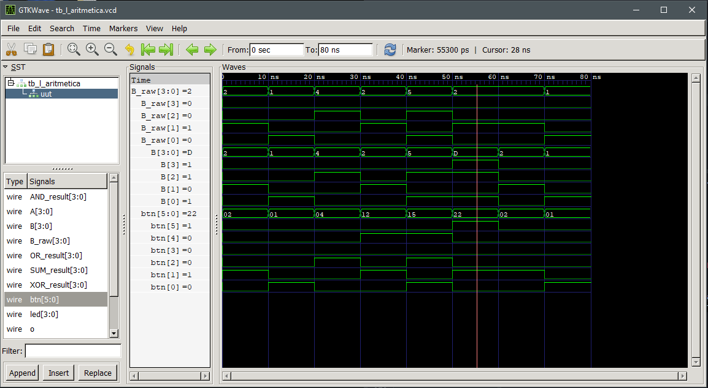
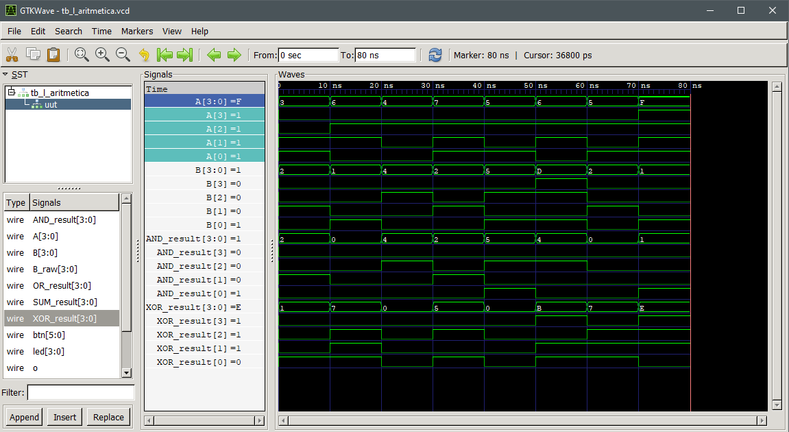
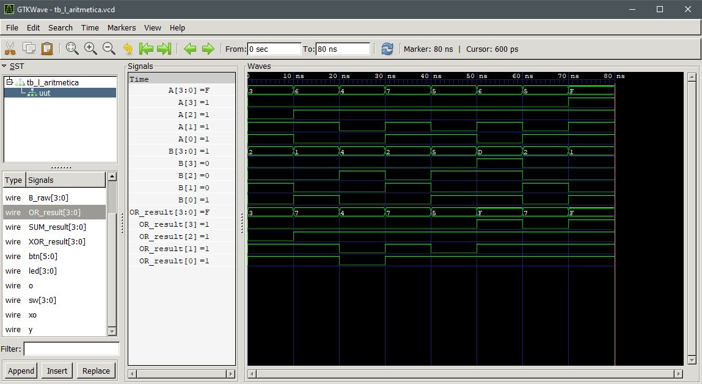
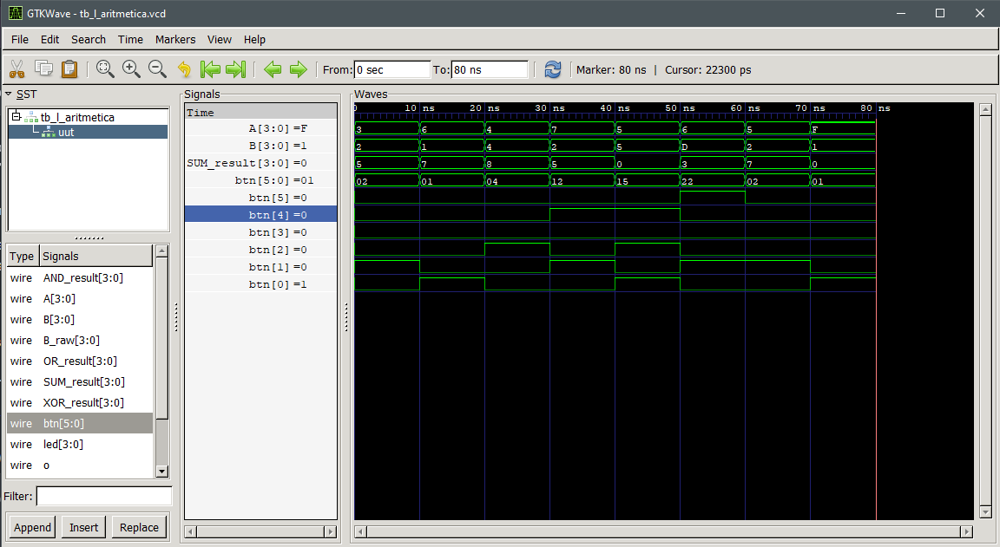

# Laboratorio 00: TÍTULO DEL LABORATORIO

---

## Integrantes

- Laura Alejandra Moreno
- Jana Rubiano Hurtado
- Johana Tellez Gamez
- Alina Idaly Ortíz Martinez

**Semestre:** 2026-1  

---

## Índice

- [Introducción](#introducción)
- [Parte 1](#parte-1)
  - [Diseño implementado](#diseño-implementado-1)
  - [Implementación y Código Verilog](#implementación-y-código-verilog-1)
- [Parte 2](#parte-2)
  - [Diseño implementado](#diseño-implementado-2)
  - [Simulaciones](#simulaciones-2)
  - [Implementación](#implementación-2)
- [Evidencias de Funcionamiento en Hardware](#evidencias-de-funcionamiento-en-hardware)
- [Conclusiones](#conclusiones)
- [Referencias](#referencias)

---

## Introducción

El objetivo de esta práctica de laboratorio es diseñar, describir e implementar un sistema digital utilizando la tarjeta de desarrollo FPGA Zybo Z7. El proyecto busca validar el procesamiento de operaciones aritméticas (suma y resta) y lógicas (AND, OR, XOR) mediante el uso de entradas físicas (switches y botones), visualizando los resultados numéricos en una barra de LEDs y el estado de las operaciones en un LED RGB, comprobando previamente su correcto funcionamiento a través de simulaciones de formas de onda en GTKWave.

---

## Parte 1

### Diseño implementado (1)

El módulo `Semaforo` implementa una máquina de estados basada en tiempo para controlar una secuencia de luces de semáforo utilizando un contador entero (`counter`) sincronizado con el reloj del sistema (`clk`). 

- **Contador principal:** Incrementa su valor en cada flanco de subida del reloj hasta alcanzar $320\,000\,000$ ciclos, momento en el cual se reinicia a cero para repetir el ciclo de manera continua.
- **Lógica de salida (`led[2:0]`):** Evalúa el valor del contador para conmutar el estado del LED RGB en 4 intervalos de tiempo definidos:
  - **Rojo (`3'b001`):** Se activa al inicio del ciclo (`counter == 0`).
  - **Amarillo (`3'b011`):** Se activa a los $80\,000\,000$ de ciclos.
  - **Verde (`3'b010`):** Se activa a los $160\,000\,000$ de ciclos.
  - **Amarillo (`3'b011`):** Se activa nuevamente a los $240\,000\,000$ de ciclos antes de reiniciar la secuencia.

---

### Código Fuente Comentado (`semaforo.v`)

```verilog
`timescale 1ns / 1ps

module Semaforo(
    input  wire       clk,  // Entrada de reloj de la FPGA
    output reg  [2:0] led   // Salida de 3 bits para los colores del semáforo
);

    integer counter = 0;    // Registro de 32 bits para contar ciclos de reloj

    // Bloque 1: Incremento y reinicio del contador de tiempo
    always @(posedge clk) begin
        if (counter >= 320000000)
            counter <= 0;                // Reinicia el contador al cumplir el ciclo completo
        else
            counter <= counter + 1;      // Incrementa 1 en cada flanco de reloj
    end

    // Bloque 2: Cambios de estado del LED según la cuenta
    always @(posedge clk) begin
        if (counter == 0)
            led <= 3'b001;               // Enciende luz Roja
        else if (counter == 80000000)
            led <= 3'b011;               // Cambia a luz Amarilla
        else if (counter == 160000000)
            led <= 3'b010;               // Cambia a luz Verde
        else if (counter == 240000000)
            led <= 3'b011;               // Cambia de nuevo a luz Amarilla
    end

endmodule
```
---

### Implementación y Código Verilog (1)
#### Código XDC
El archivo de restricciones XDC se asignó únicamente los puertos estrictamente necesarios para el funcionamiento del semáforo. En este caso, se mantuvo activa de forma exclusiva la señal de reloj principal (`clk`) mapeada al pin `K17` de la FPGA Zybo Z7 y las salidas de 3 bits de la variable `led` se mapearon directamente a las líneas de control del LED RGB #6 incorporado en la tarjeta (`V16`, `F17` y `M17`).

A diferencia de otros módulos combinacionales, este diseño no requiere entradas físicas como interruptores (`sw`) ni botones (`btn`), ya que el ciclo del semáforo avanza de manera totalmente autónoma mediante la cuenta de ciclos de reloj. Por esta razón, el resto de los pines de periféricos en el archivo XDC permanecieron comentados.

#### Comportamiento Obtenido
Una vez programada la FPGA, el sistema inició automáticamente su ciclo secuencial sincronizado con el reloj del sistema. La salida controló las transiciones de color en el LED RGB pasando periódicamente entre Rojo (`3'b001`), Amarillo (`3 me 'b011`), Verde (`3'b010`) y nuevamente Amarillo (`3'b011`), manteniendo cada estado según el número de ciclos especificado en los rangos del contador antes de reiniciar la secuencia. Los resultados obtenidos fueron presentados y aprobados por el docente durante la sesión de laboratorio.


---

## Parte 2

### Diseño implementado (2)

En este caso, el diseño del sistema digital es puramente combinacional (no posee reloj ni elementos de memoria/máquina de estados). El circuito procesa los operandos de entrada $A$ y $B$ para calcular de forma paralela tres operaciones lógicas (AND, OR, XOR) y una operación aritmética (suma o resta). El resultado numérico se despliega en una barra de LEDs, mientras que la activación de las operaciones lógicas se indica mediante la combinación de colores en un LED RGB.

#### Construcción de los operandos
- **Operando A ($A$):** Se toma directamente desde la entrada de los 4 switches (`sw[3:0]`).
- **Operando B ($B$):** Se obtiene de los primeros 4 botones (`btn[3:0]`). Si el botón de control `btn[5]` se activa (1), los bits de $B$ se invierten (complemento a 1) mediante una operación XOR bit a bit con `4'b1111`; de lo contrario, mantienen su valor original.

#### Mapeo de las salidas (LEDs)
- **Barra de LEDs (`led[3:0]`):** Muestra el resultado de 4 bits de la operación aritmética seleccionada por `btn[4]` ($A - B$ si está presionado, o $A + B$ si no lo está).
- **LED RGB (`y`, `o`, `xo`):** Utiliza operadores de reducción OR (`|`) para indicar si existe al menos un bit en '1' en cada operación lógica:
  - **`y` (Canal Rojo):** Se activa si hay bits en '1' en el resultado de la operación AND.
  - **`o` (Canal Verde):** Se activa si hay bits en '1' en el resultado de la operación OR.
  - **`xo` (Canal Azul):** Se activa si hay bits en '1' en el resultado de la operación XOR.

---

### Código Fuente (`l_aritmetica.v`)

```verilog
module l_aritmetica (
    input  wire [3:0] sw,   // Entrada de switches (Operando A)
    input  wire [5:0] btn,  // Entrada de botones (B_raw, selección y control)
    // LED SUMA O RESTA
    output wire [3:0] led,  // Muestra el resultado de suma o resta
    // LED RGB
    output wire       y,    // Rojo: Indica presencia de bits en AND
    output wire       o,    // Verde: Indica presencia de bits en OR
    output wire       xo    // Azul: Indica presencia de bits en XOR
);

    wire [3:0] A     = sw;                       // Operando A desde switches
    wire [3:0] B_raw = btn[3:0];                 // Operando B base desde botones
    wire [3:0] B     = B_raw ^ {4{btn[5]}};      // Si btn[5]=1 invierte bits de B (Compl. a 1)

    // Operaciones lógicas en paralelo
    wire [3:0] AND_result = A & B;               // AND bit a bit entre A y B
    wire [3:0] OR_result  = A | B;               // OR bit a bit entre A y B
    wire [3:0] XOR_result = A ^ B;               // XOR bit a bit entre A y B

    // Selección aritmética: Resta con btn[4]=1, Suma con btn[4]=0
    wire [3:0] SUM_result = btn[4] ? (A - B) : (A + B); 

    // Asignación de salidas
    assign led = SUM_result;                     // Salida numérica principal a los LEDs
    assign y   = |AND_result;                    // Reducción OR: 1 si algún bit de AND es 1
    assign o   = |OR_result;                     // Reducción OR: 1 si algún bit de OR es 1
    assign xo  = |XOR_result;                    // Reducción OR: 1 si algún bit de XOR es 1

endmodule
```
---

### Simulaciones (2)

El funcionamiento lógico del sistema se verificó mediante simulación en **GTKWave**, evaluando la respuesta de los operandos, las operaciones lógicas y la unidad de suma/resta.

#### 1. Inversión de bits del Operando B (`btn[5]`)
Se comprobó la lógica de acondicionamiento del operando B. Cuando el botón 5 está activo (`btn[5] = 1`), el valor original ingresado por los botones (`B_raw`) se invierte bit a bit para formar el operando B (`B = ~B_raw`). Cuando `btn[5] = 0`, el valor se mantiene idéntico (`B = B_raw`).



#### 2. Operaciones Lógicas (AND, OR, XOR)
Se validó la respuesta de las operaciones lógicas bit a bit:
- **Operación AND y XOR:** La salida `y` se activa en '1' únicamente si existe al menos un bit en '1' en el resultado de `A & B`. La salida `xo` se activa en '1' si los bits difieren entre A y B (`A ^ B`).



- **Operación OR:** La salida `o` se activa en '1' siempre que al menos un bit del resultado de `A | B` sea igual a '1'.



#### 3. Operación Aritmética (Suma y Resta)
Por último, se verificó la operación de la unidad aritmética:
- Cuando el botón de control está desactivado (`btn[4] = 0`), la salida `led` entrega la suma exacta de los operandos (`A + B`).
- Al activar el botón (`btn[4] = 1`), la operación conmuta dinámicamente a la resta (`A - B`), entregando resultados matemáticos consistentes durante la simulación.




## Implementación (2)

###  Código XDC
El diseño utiliza una arquitectura puramente combinacional que se mapea directamente a los componentes de la tarjeta mediante el archivo XDC. Los interruptores `sw[3:0]` en los pines `G15`, `P15`, `W13` y `T16` ingresan los operandos junto a los botones `btn[0]` a `btn[3]`, los botones externos `btn[4]` y `btn[5]` que activan funciones como sumar o invertir. El resultado procesado se envía de forma inmediata a los LEDs monocromáticos `led[3:0]` en los pines `M14`, `M15`, `G14` y `D18`, así como a los pines de control `V16`, `F17` y `M17` del LED RGB.

Este módulo no utiliza ninguna señal de reloj global ya que todo el procesamiento es asíncrono . Como consecuencia, las líneas de reloj en el archivo de restricciones permanecieron comentadas. Tampoco se asignó ni se requiere un botón de reset, debido a que el sistema carece de elementos de memoria como flip-flops o registros que necesiten ser inicializados.

###  Comportamiento Esperado
Cualquier modificación en la posición de los interruptores o la presión de los botones genera un cambio instantáneo en las salidas del sistema. Los LEDs monocromáticos muestran directamente el valor binario del resultado de suma o resta en tiempo real, mientras que las líneas del LED RGB reflejan los modos de operación activos.

---

## Evidencias de Funcionamiento en Hardware

El funcionamiento del código implementado para el ejercicio 2 se puede observar a través del siguiente enlace:  
[Demostración de funcionamiento en Canva](https://canva.link/6p9u82qlti3agio)

---

## Conclusiones

Durante la realización de este laboratorio comprendimos cómo funciona el diseño de circuitos digitales entendiendo que el hardware procesa todo al mismo tiempo a diferencia de la programación tradicional en software, lo que nos permitió integrar operaciones lógicas y aritméticas en un solo módulo combinacional. En este proceso, simular primero en GTKWave fue clave para revisar y corregir el comportamiento de las señales antes de cargarlo a la FPGA, lo que nos ahorró mucho tiempo buscando errores directamente en la tarjeta, una vez probado el funcionamiento en simulación bastó con configurar las entradas de la tarjeta y subir el código para ver el comportamiento esperado.

---

## Referencias

- **AMD / Xilinx:** *Zynq-7000 SoC Technical Reference Manual (UG585)*. Disponible en: [https://docs.amd.com/r/en-US/ug585-zynq-7000-SoC-TRM/Introduction](https://docs.amd.com/r/en-US/ug585-zynq-7000-SoC-TRM/Introduction)
- **Digilent:** *Zybo Z7 Reference Manual*. Disponible en: [https://digilent.com/reference/programmable-logic/zybo-z7/reference-manual](https://digilent.com/reference/programmable-logic/zybo-z7/reference-manual)
- **IEEE Standard Association:** *IEEE Std 1364-2005: Standard Verilog Hardware Description Language*.